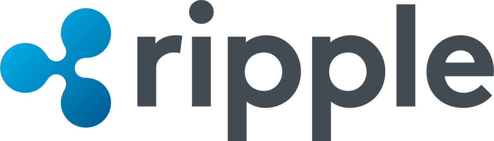

# Ripple-Fintech-Case-Study

## Overview and Origin

* Ripple

* Incorporated in 2012

* Founders: Chris Larsen, Jed McCaleb, Arthur Britto, and Ryan Fugger

* Current CEO [Brad Garlinghouse](https://en.wikipedia.org/wiki/Brad_Garlinghouse)
* 
* 

* Ripple provides one frictionless experience to send money globally using the power of blockchain.

* As of March 19, 2022 Ripple has raised a total of $293.8M in funding over 14 rounds from a Series B round.

## Business Activities:

* Authored by Arthur Britto, David Schwartz, & Ryan Fugger, Ripple is the name of a payment network and the payment protocol that was developed and released in 2012. Their goal is order to enable "secure, instant and nearly free global financial transactions". It is built on principles similar to those of Bitcoin, so many people consider it a cryptocurrency.

* Ripple provides one frictionless experience to send money globally using the power of blockchain. It offers a global real-time payment system that enables banks and financial institutions around the world to directly transact with each other without the need for a central correspondent. One of Ripple's differentiating componets is  FX Market Making, which is a solution enablingenterprises that opens the ability for cross-currency liquidity using a distributed network that allows foreign exchange to be externally sourced from a competitive FX marketplace or an internal FX trading desk. This minimizes FX exposure thereby lowering the volatility and counter-party risk of trades. Ripple Insights features industry updates, insider perspectives, and in-depth market analysis.

* Currently Ripple is using 38 technology products and services which include HTML5, Google Analytics, and jQuery. They are also using 118 technologies for its website including Viewport Meta, IPhone / Mobile Compatible, and SPF.

## Landscape:

* In a post pandemic world the ever expanding internet is growing faster then before due to the rising demand for immediate payment solutions. Ripple seaks to revolutionize the payments space by using blockchain and cyprtocurrency.

* Some of Ripple's alternativees include IBM Blockchain, Ethereum, Steller, Oracle Blockchain Cloud Service, Tangle, Bitcoin, Quorum, and Blockstream.

## Results

* Despite the current SEC lawsuit against Ripple which as slowly down it's growth they are growing rapidly around the globe.

## Recommendations

* There is a growing interst in NFT's that Ripple should investigate if they have not begun one.

* Once the SEC lawsuit is settled and Ripple is able to provide it's services to the largest market in the world the demand for the services will increase dramatically. My concern is that their network is able to handle the increase in demand.

## Sources
* https://ripple.com/files/ripple_consensus_whitepaper.pdf
* https://www.researchgate.net/profile/Shailak-Jani/publication/322436263_An_Overview_of_Ripple_Technology_its_Comparison_with_Bitcoin_Technology/links/5a58ad76458515211cc8a6e4/An-Overview-of-Ripple-Technology-its-Comparison-with-Bitcoin-Technology.pdf
* https://www.crunchbase.com/organization/ripple-labs
* https://www.finextra.com/pressarticle/85513/former-jpmorgan-chase-chief-regulatory-affairs-officer-sandie-oconnor-joins-ripple
* https://www.gartner.com/reviews/market/blockchain-platforms/vendor/ripple/product/ripple/alternatives

